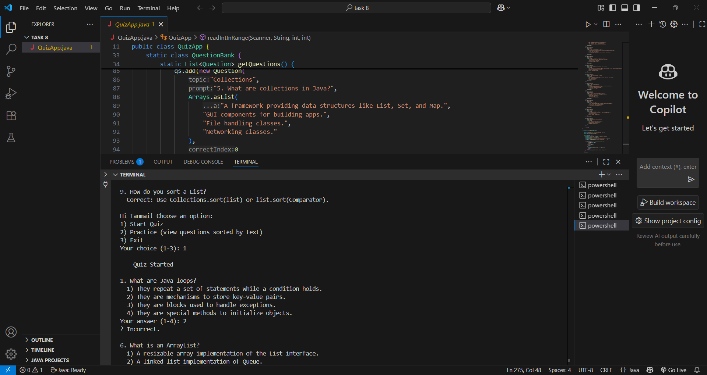

# 📚 Online Quiz App – Java Console Project

## 📖 Overview
This is a **Java console-based quiz application** where users can answer multiple-choice questions, get their scores instantly, and improve their knowledge interactively. It’s simple, beginner-friendly, and perfect for understanding **Java basics**, control flow, and input handling.

## 🎯 Objective
- Create a quiz with predefined questions and answers.
- Take user input from the console.
- Display results at the end.

## 🛠 Tools Used
- **Java** – Core programming language.
- **Console** – For input/output interaction.

## 📂 Deliverables
- Java class for **quiz questions** and **result calculation**.

 ## 🖼 Screenshot  

## 📌 Repository Link
[Online Quiz App – Java](https://github.com/sudhatanmai/online-quiz-app-java/tree/main)

## 👩‍💻 Author
**Sudha Tanmai (av)** – Passionate learner and aspiring Java developer, exploring programming through hands-on mini projects.

